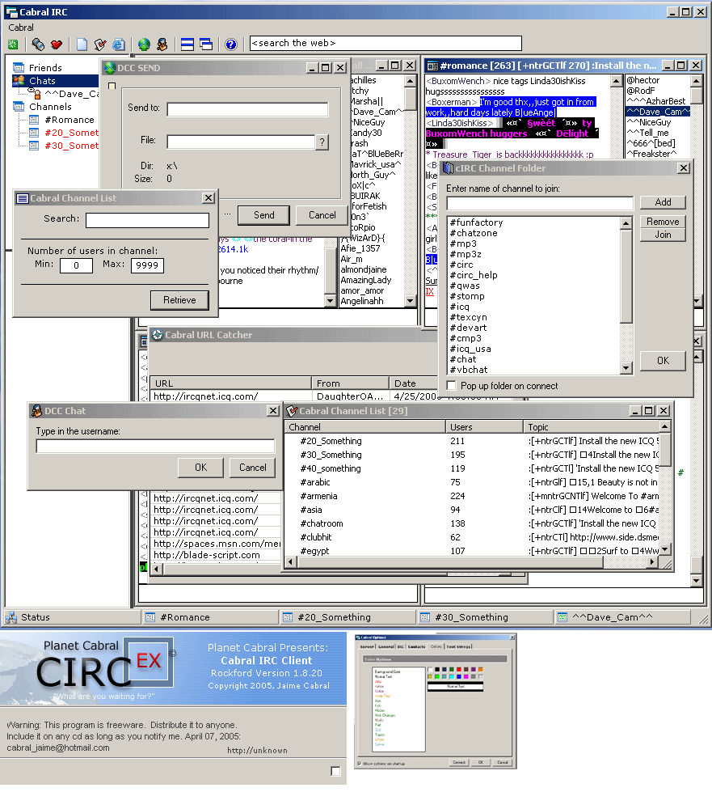



## Cabral IRC EX \(open source irc client\) \- Rerelease

### Description

If you like or use the code please read the agreements and VOTE for me(?). I have decided to rerelease the irc client due to the fact that there has been many requests for it. This client is a bare bones COMPLETE irc client, bare bones meaning that there are no external ocx or active x controls, pure vb coding. The code is commented the best and could be.

There have been many other irc clients that are OPEN SOURCE that have used all or some of the code from my irc client including the following irc clients:

secureIRC

nexIRC

dIRCal

bsIRC

flexIRC

Hope you enjoy it....please email me if you'd like a copy of the early alpha stage for the new irc client.

Thank You,

Jaime
 
### More Info
 
This code was developed with VB6.0 Enterprise, utilizing many of the enterprise controls. I'm in the process of creating a new multi-server irc client with the main focus on file transfers and user to user interaction (games, cams, pics) and such.

The code has everything a normal irc client has, file transfers, colors, and multiple windows.

             |
---                |---
**Submitted On**   |2005-04-26 14:21:28
**By**             |[Jaime Cabral](https://github.com/Planet-Source-Code/PSCIndex/blob/master/ByAuthor/jaime-cabral.md)
**Level**          |Advanced
**User Rating**    |4.9 (59 globes from 12 users)
**Compatibility**  |VB 6\.0
**Category**       |[Internet/ HTML](https://github.com/Planet-Source-Code/PSCIndex/blob/master/ByCategory/internet-html__1-34.md)
**World**          |[Visual Basic](https://github.com/Planet-Source-Code/PSCIndex/blob/master/ByWorld/visual-basic.md)
**Archive File**   |[Cabral\_IRC1881394262005\.zip](https://github.com/Planet-Source-Code/jaime-cabral-cabral-irc-ex-open-source-irc-client-rerelease__1-60225/archive/master.zip)

